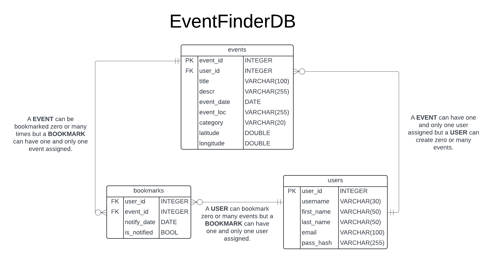
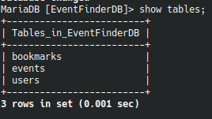
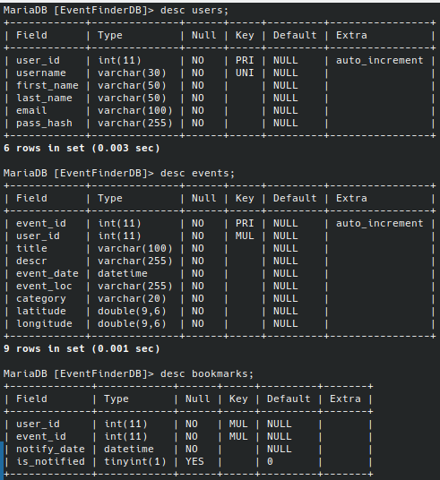
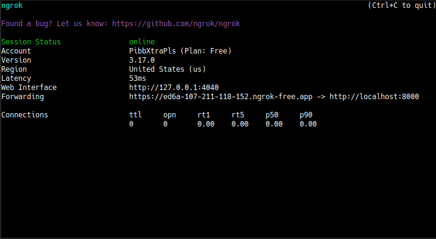
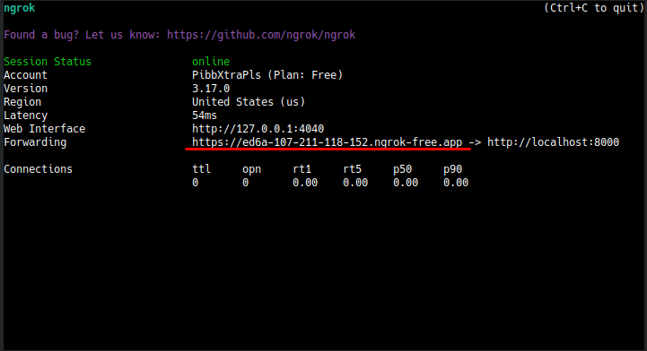
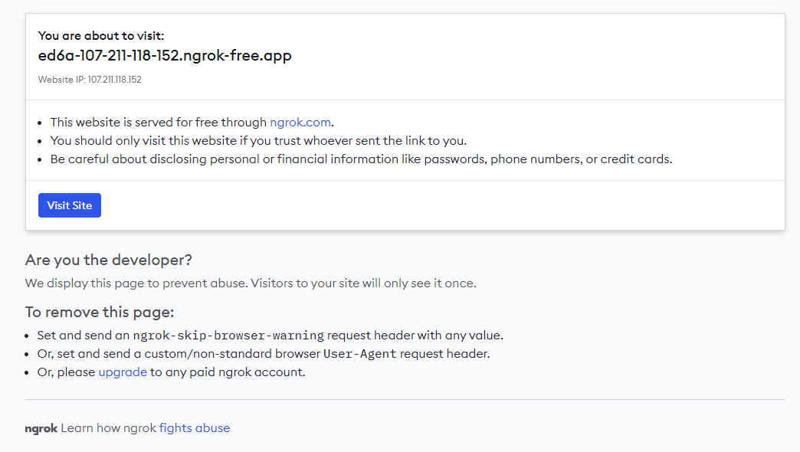
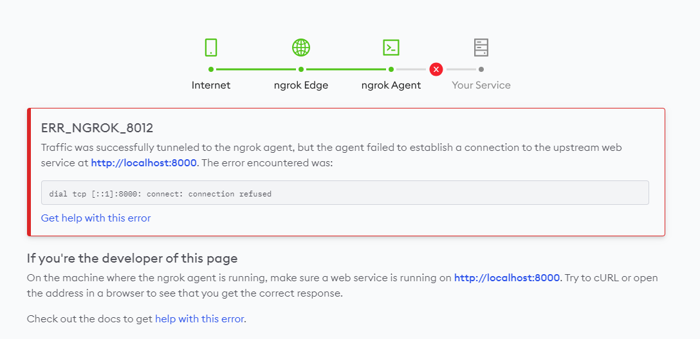

The overall goal is to create an event finder app as described in class and based off of our sprints. Our sprint backlog is located in /docs/Event_App_Backlog.pdf (which you need to open outside of a text editor to view).
# EventFinderApp Project Instructions

## Overview
This document provides instructions on how to set up your MariaDB database and how to run the Event Finder web application.

## Setup Instructions
### Steps to Use `setup_mariadb.sh`

Here is a diagram of the database you are creating:

<p align="center">
  
</p>

To begin we need to set up the database:

1. **Pull Down the Latest from Git**<br>
   Make sure you have the latest version of the repository by pulling down the latest changes:
   ```bash
   git pull origin <branch_name>
   ```
2. **Locate the `create.sql` File**<br> Note the location of the `create.sql` file on your machine. Update the `CREATE_SQL_PATH` variable in `setup_mariadb.sh` with the full path to this file.
    For example, if your file is located at `/home/student/ps2/EventFinderApp/database_setup/create.sql`, you would set:
    ```bash
    CREATE_SQL_PATH="/home/student/ps2/EventFinderApp/database_setup/create.sql"
    ```
3. **Ensure `setup_mariadb.sh` is Executable**<br> Before running the script, make sure that `setup_mariadb.sh` is executable. You can do this by running:
    ```bash
    chmod +x setup_mariadb.sh
    ```
4. **Run the Setup Script**<br> Execute the setup script:
    ```bash
    ./setup_mariadb.sh
    ```
5. **Logging into MariaDB**<br> Once the script runs successfully, you should be able to log into the database using:
    ```bash
    mysql -u student -p
    ```
The password is `UApass50`.

6. **Using the Database**<br> After logging in, select the database:
    ```bash
    USE EventFinderDB;
    ```
7. **Show Tables**<br> To see the tables created in your database, run:
    ```bash
    SHOW TABLES;
    ```
    This should return:
    
    

8. **Describing Tables**<br> To ensure that the tables were created with the correct fields, describe each table by typing:
    ```bash
    DESC <table_name>;
    ```
    This should return:
    
    

## Installing and using ngrok

### Downloading and Installing ngrok

To utilize the Geolocation API in most web browsers, requests must be made over a secure HTTPS connection. You can use ngrok to expose the app via an HTTPS URL.

1. **Download ngrok**  <br>

    - Open the web browser on your VM and type this in the address bar:

    ```bash
    https://ngrok.com/download
    ```
    Click "Linux" and then under "Download ZIP file" choose the appropriate architecture(Usually x86-64).

2. **Unzip ngrok**  <br>

    - Once you have downloaded ngrok, open the terminal and run the following command:

    ```bash
    sudo tar xvzf ~/Downloads/ngrok-v3-stable-linux-amd64.tgz -C /usr/local/bin
    ```
    This unzips the folder and places it in /usr/local/bin.

3. **Acquire an Authtoken**<br>

    - For this step, you will need an Authtoken. You can get an Authtoken for free by making an account on the ngrok website.

    - Once you have acquired the Authtoken, run the following command:

    ```bash
    ngrok config add-authtoken <your-authtoken>
    ```

4. **Exposing the Local Web Server**<br>

    - Run the following command to expose the app using an HTTPS URL:

    ```bash
    ngrok http <port>
    ```

    The port should be set to the same port that your PHP development server is listening on.

    For example, if you ran this command to start your PHP development server:

    ```bash
    php -S localhost:8000 controllers/controller.php {path_to_EventFinder_folder}
    ```

    The port would be 8000.

    After you run the command you should see this:

    

    Copy the forwarding URL and paste it into the web browser on the host machine, not the VM:
  
    

    When you go to the website, you will see a warning:

    

    Click the blue "Visit Site" button.

   **Note:** Until you run through the "Running Instructions" secton you will see the following error:

   

## Running Instructions 
### Prerequisites
Ensure you have the following installed:
1. PHP 7.x or higher
2. Web browser for accessing the application
3. The database setup for Event Finder should be completed (view "Steps to Use setup_mariadb.sh" section). Ensure your database is properly configured and accessible.
4. Ngrok should be installed and set up (view "Downloading and installing ngrok" section.
### Steps to run the Event Finder Web Application
1. **Run PHP built-in web server:**<br>
    - Open your terminal and navigate to the root folder of the EventFinder project.
    - Run the following command:
    ```bash
    php -S localhost:8000 controllers/controller.php {path_to_EventFinder_folder}
    ```

    For example: if your EventFinder is located at "~/ps2/EventFinder/", you would run: 
    ```bash
    php -S localhost:8000 controllers/controller.php ~/ps2/EventFinderApp/
    ```
2. **Access the Application** <br> Open your web browser and navigate to:
    ```bash
    http://localhost:8000
    ```

Project Contributors:
www.linkedin.com/in/chickm00
www.linkedin.com/in/c-m-x/
www.linkedin.com/in/ayden-haslam-44bz
https://github.com/Pibb-Xtra-Pls/
