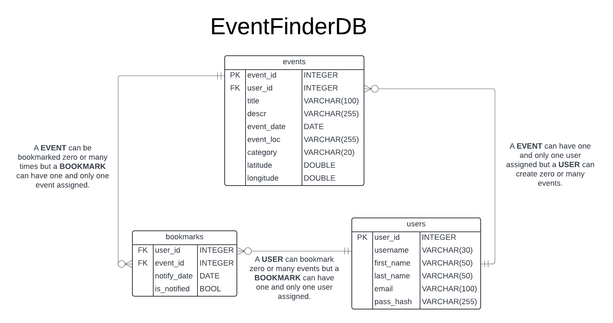
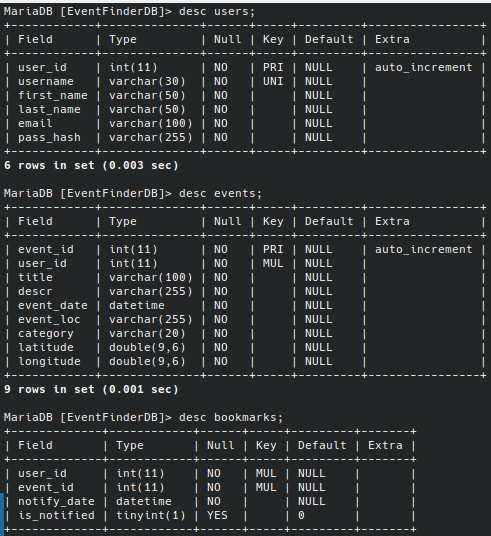

# Database Setup Instructions

## Overview
This document provides instructions on how to set up your MariaDB database using the `setup_mariadb.sh` script.

Here is a diagram of the database you are creating:

<p align="center">
  
</p>

## Steps to Use `setup_mariadb.sh`

1. **Pull Down the Latest from Git**<br>
   Make sure you have the latest version of the repository by pulling down the latest changes:
   ```bash
   git pull origin <branch_name>
   ```
2. **Locate the `create.sql` File**<br> Note the location of the `create.sql` file on your machine. Update the `CREATE_SQL_PATH` variable in `setup_mariadb.sh` with the full path to this file.
For example, if your file is located at `/home/student/ps2/EventFinderApp/create.sql`, you would set:
```bash
CREATE_SQL_PATH="/home/student/ps2/EventFinderApp/create.sql"
```
3. **Ensure `setup_mariadb.sh` is Executable**<br> Before running the script, make sure that `setup_mariadb.sh` is executable. You can do this by running:
```bash
chmod +x setup_mariadb.sh
```
4. **Run the Setup Script**<br> Execute the setup script:
```bash
./setup_mariadb.sh
```
5. **Logging into MariaDB**<br> Once the script runs successfully, you should be able to log into the database using:
```bash
mysql -u student -p
```
The password is `UApass50`.

6. **Using the Database**<br> After logging in, select the database:
```bash
USE EventFinderDB;
```
7. **Show Tables**<br> To see the tables created in your database, run:
```bash
SHOW TABLES;
```
This should return:


8. **Describing Tables**<br> To ensure that the tables were created with the correct fields, describe each table by typing:
```bash
DESC <table_name>;
```
This should return:


